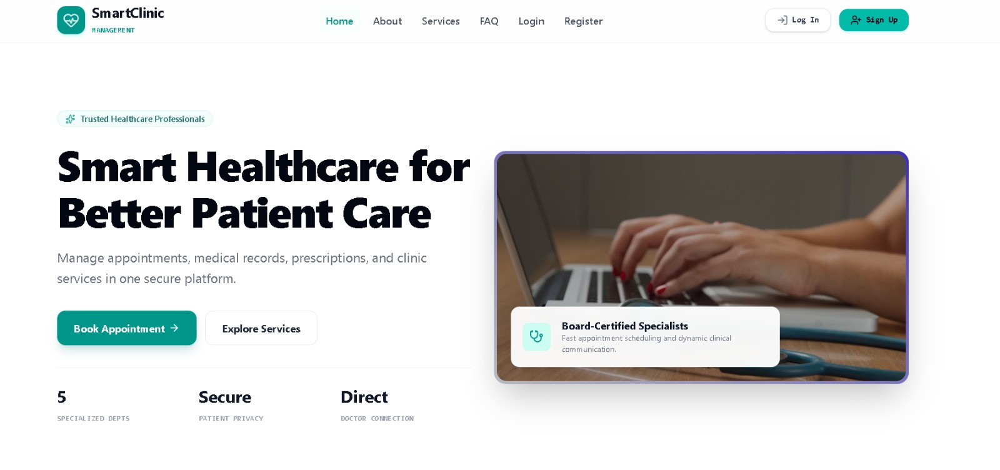
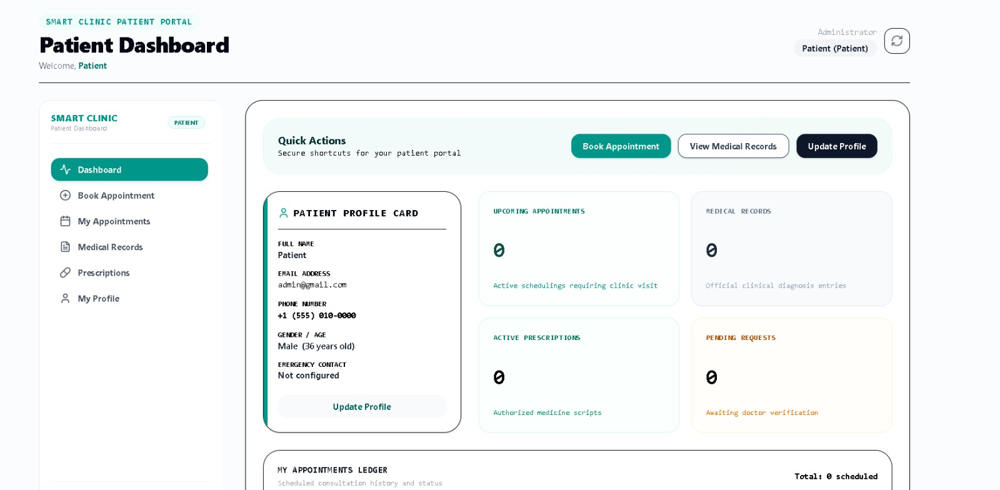
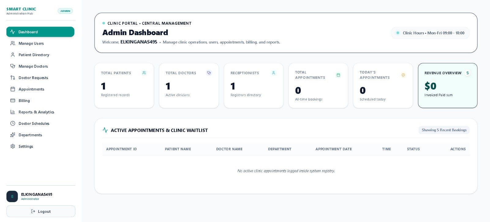
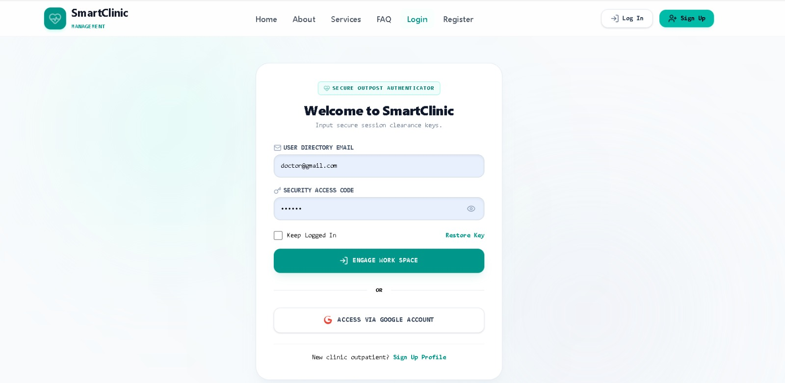
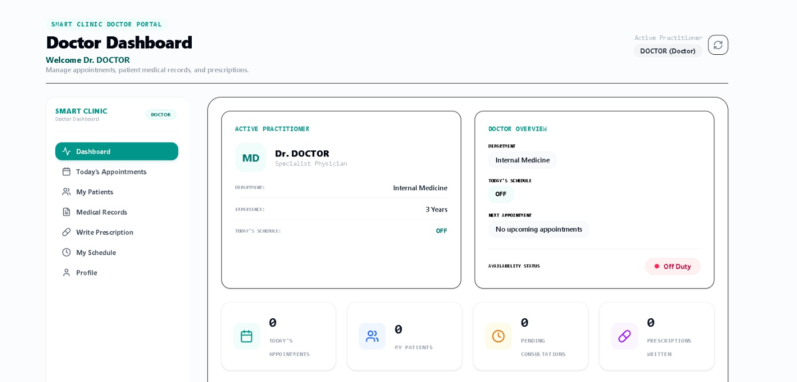
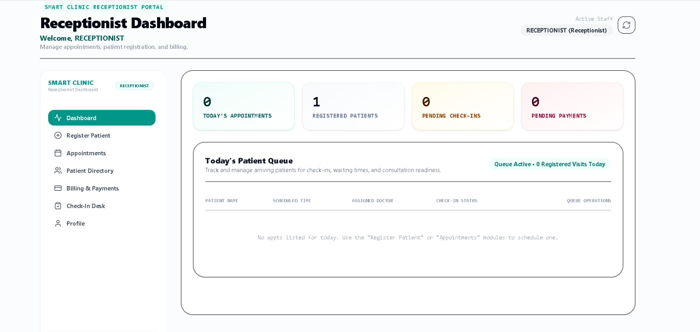

#  Smart Clinic Healthcare


> A modern web application designed to streamline clinic operations, improve patient experience, and manage healthcare records efficiently.

 **Live Website:** [Smart Clinic Healthcare](https://agent-6a35b62f67d5ad83e12--smartclinichealthcare.netlify.app/)

---

##  Table of Contents
- [About The Project](#-about-the-project)
- [Key Features](#-key-features)
- [Technologies Used](#-technologies-used)
- [Getting Started](#-getting-started)
- [Project Structure](#-project-structure)
- [Application Modules & Dashboards](#-application-modules--dashboards)
- [Team Members](#-team-members)

---

##  About The Project

**Smart Clinic Healthcare** is a comprehensive clinic management system aimed at digitizing day-to-day medical facility workflows. The platform provides an intuitive interface for both patients and healthcare providers to manage appointments, track medical histories, and simplify administrative tasks.

---

##  Key Features

-  **Appointment Management:** Easy scheduling, rescheduling, and cancellation of doctor appointments.
-  **Doctor & Staff Profiles:** Detailed profiles for healthcare providers including their specialties and working hours.
-  **Patient Portal:** Secure access for patients to view their medical records and upcoming visits.
-  **Responsive Design:** Fully optimized for mobile, tablet, and desktop viewing.
-  **Secure Data Handling:** Ensuring patient privacy and secure data storage (HIPAA compliance ready).

---

## 🛠 Technologies Used

### 1. Front-End Technology Stack (User Portal & Admin Interface)
The client-side interface is developed as a modern Single Page Application (SPA) designed for multi-role workflows (Admin, Outpatient, Doctor, and Receptionist):
- **Core UI Framework:** React 18 paired with TypeScript for strongly-typed, reusable dashboard panels.
- **Build Pipeline:** Vite 5 for highly-optimized client assets and fast hot-reloads.
- **Styling Engine:** Tailwind CSS managing adaptive layouts, custom fluid typography, slate theme palettes, and grid containers.
- **Micro-Animations:** Motion (`motion/react`) powering smooth transitions, slide-in panels, and modal entries.
- **Data Visualization:** Recharts visualizes clinical metrics, patient visits, and revenue flow on interactive SVG layouts.
- **Data Sync Hub:** A synchronization helper (`src/db/localDb.ts`) linking screen behaviors to both `localStorage` and real-time Firestore listeners.

### 2. Back-End Technology Stack (ASP.NET Core MVC Hub)
The backend is configured as an ASP.NET Core 8.0 Web Application following the Model-View-Controller (MVC) architecture:
- **Runtime:** ASP.NET Core 8.0 (C#) powered by the `Microsoft.NET.Sdk.Web` framework.
- **Controllers (`/Controllers`):** 
  - `AppointmentsController.cs`: Orchestrates scheduling, booking new visits (`Book`), and updating ongoing status (`UpdateStatus`).
  - `HomeController.cs`: Handles core routing and landing views.
- **Models (`/Models`):** Strongly-typed C# entities matching frontend data structures (`User`, `Patient`, `Doctor`, `Appointment`, `Prescription`, `Invoice`).
- **Views (`/Views`):** Standard server-rendered Razor templates (`Index.cshtml`), layouts, and import statements.
- **Services Layer (`/Services/FirebaseService.cs`):** Registered as a singleton in `Program.cs` utilizing `FirebaseAdmin` and `Google.Cloud.Firestore` to centrally manage cloud collections while pre-seeding initial clinical models in-memory for rapid responsiveness.
- **SPA Fallback Pipeline:** Configured in `Program.cs` to force ASP.NET Core to handle MVC operations, serve static files, and dynamically fall back to `index.html` for React routing requests:
  ```csharp
  app.UseStaticFiles();
  app.MapControllerRoute(
      name: "default",
      pattern: "{controller=Home}/{action=Index}/{id?}");
  app.MapFallbackToFile("index.html");
  ```

### 3. Database & Security
- **Global Database:** Google Cloud Firestore serving as the real-time transactional database keeping patients, staff, schedules, and invoices in continuous sync.
- **Authentication:** Firebase Authentication handling secure client profile matching and role assignments.
- **Access Control:** Firestore Rules (`firestore.rules`) enforcing strict role-based access policies (Admin, Doctor, Receptionist, Patient).

---

##  Getting Started

Follow these steps to set up the project locally on your machine.

### Prerequisites
- [.NET 8.0 SDK](https://dotnet.microsoft.com/download/dotnet/8.0)
- [Node.js](https://nodejs.org/) (v18 or higher)
- [Git](https://git-scm.com/)

### Installation

1. **Clone the repository:**
   ```bash
   git clone https://github.com/YourUsername/smart-clinic-healthcare.git
   cd smart-clinic-healthcare
   ```

2. **Backend Setup (.NET):**
   ```bash
   dotnet restore
   dotnet run
   ```

3. **Frontend Setup (Vite + React):**
   ```bash
   npm install
   # or
   yarn install

   npm run dev
   ```

4. **Environment Configuration:**
   - Configure Firebase administrative credentials inside `appsettings.json` for the backend.
   - Create a `.env` file in the root client directory with your Firebase public configuration keys.

---

##  Project Structure

```text
📦 smart-clinic-healthcare
 ┣ 📂 Controllers     # ASP.NET Core routing actions (AppointmentsController, HomeController)
 ┣ 📂 Models          # Strongly-typed C# representations (User, Patient, Doctor, Appointment)
 ┣ 📂 Services        # Backend Services (FirebaseService.cs)
 ┣ 📂 Views           # Standard server-rendered Razor templates (_Layout.cshtml, Index.cshtml)
 ┣ 📂 src             # React Frontend Source Code
 ┃ ┣ 📂 components    # Reusable UI components & specialized role views
 ┃ ┣ 📂 db            # Local synchronization helpers (localDb.ts)
 ┃ ┣ 📂 pages         # Dashboard panels and routing views
 ┃ ┗ 📜 App.tsx       # Main application component
 ┣ 📜 Program.cs      # .NET App configuration, services, & SPA Fallback Pipeline
 ┣ 📜 firestore.rules # Firebase secure access control policies
 ┣ 📜 package.json    # Frontend dependencies
 ┗ 📜 README.md       # Project documentation
```

---

##  Application Modules & Dashboards

### Home Page (Landing Page)

**Purpose:**
The main page of the Smart Clinic system that introduces the platform and its healthcare services.
**Main Features:**
Displays clinic information and services. 
Allows users to navigate to Login or Register pages. 
Provides a quick Book Appointment button. 
Highlights key advantages: 
5 Specialized Departments 
Secure Patient Privacy 
Direct Doctor Communication 
**Database Interaction:**
May load departments and doctors dynamically from Firebase. 
**User Role:**
Public page (accessible to all visitors before login).

### Login Page

**Purpose:**
Allows users to securely access the Smart Clinic system.
**Main Features:**
Login using Email and Password. 
"Keep Logged In" option. 
Password recovery (Restore Key). 
Login with Google Account. 
Link to Registration Page. 
**Database Interaction:**
Verifies user credentials using Firebase Authentication. 
Retrieves user role (Admin, Doctor, Receptionist, Patient). 
**User Role:**
All system users. 
**After Login:**
Redirects users to their corresponding dashboard based on their role.

### Admin Dashboard

**Purpose:**
The central control panel used by the Administrator to manage the entire clinic system.
**Main Features:**
View clinic statistics (Patients, Doctors, Receptionists, Appointments, Revenue). 
Manage users and patient records. 
Manage doctors and approve doctor requests. 
Monitor appointments and billing. 
View reports and analytics. 
Manage departments, schedules, and system settings. 
**Database Interaction:**
Reads and updates data from Firebase collections: 
Users 
Patients 
Doctors 
Appointments 
Billing 
Departments 
**User Role:**
Administrator only.

### Patient Dashboard

**Brief Description:**
This page is the main portal for patients after logging in. It allows patients to manage appointments, view medical information, and update personal details.
**Main Features:**
Quick Actions: Fast access to: 
Book Appointment 
View Medical Records 
Update Profile 
Patient Profile Card: Displays personal information such as name, email, phone number, gender, and emergency contact. 
Upcoming Appointments: Shows scheduled future appointments. 
Medical Records: Displays the number of available medical records. 
Active Prescriptions: Lists current prescriptions issued by doctors. 
Pending Requests: Shows appointment or medical requests awaiting approval. 
Appointments Ledger: Provides a history of the patient's appointments and their status. 
Navigation Menu: Allows access to appointments, medical records, prescriptions, and profile management. 
**Purpose:**
To give patients a centralized dashboard where they can manage their healthcare information and clinic interactions efficiently.

### Receptionist Dashboard (Brief Explanation)

**Purpose:**
This page is used by the Receptionist to manage patients, appointments, check-ins, and billing activities.
**Main Features:**
Dashboard Overview 
Shows quick statistics: 
Today's Appointments 
Registered Patients 
Pending Check-ins 
Pending Payments 
Register Patient 
Add new patients to the clinic system. 
Appointments 
Schedule, update, or cancel patient appointments. 
Patient Directory 
View and manage all registered patients. 
Billing & Payments 
Process invoices and track payment status. 
Check-In Desk 
Manage patient arrivals and appointment check-ins. 
Today's Patient Queue 
Displays patients scheduled for today. 
Shows appointment time, assigned doctor, and check-in status. 
Profile 
View and update receptionist account information. 
**User Role:**
The Receptionist acts as the communication bridge between patients and doctors, ensuring appointments, registrations, check-ins, and payments are handled smoothly.

### Doctor Dashboard (Brief Explanation)

**Purpose:**
This page is used by Doctors to manage appointments, patients, medical records, and prescriptions.
**Main Features:**
Doctor Profile Overview 
Displays doctor name, specialization, department, experience, and availability status. 
Today's Appointments 
View scheduled consultations for the day. 
My Patients 
Access assigned patient information and medical history. 
Medical Records 
Review and update patient diagnoses and treatment records. 
Write Prescription 
Create and manage patient prescriptions. 
My Schedule 
View working hours and upcoming appointments. 
Statistics Cards 
Total appointments today. 
Number of assigned patients. 
Pending consultations. 
Prescriptions written. 
**User Role:**
The Doctor is responsible for examining patients, updating medical records, managing consultations, and issuing prescriptions within the clinic system.

---

##  Team Members

| Name | Role | GitHub |
| :--- | :--- | :--- |
| **Anas Mohammed** | Team Leader & Backend Developer | [@anas-mohammed1712](https://github.com/anas-mohammed1712) |
| **Yousef Mohamed** | Backend Developer | [@ym853840-svg](https://github.com/ym853840-svg) |
| **Asmaa Ashraf** | Database Administrator | [@AsmaaAshraf733](https://github.com/AsmaaAshraf733) |
| **Ziad Nabil** | Frontend Developer | [@nbylzyad11-svg](https://github.com/nbylzyad11-svg) |
| **Ahmed Ehab** | Documentation & Testing | [@Ahmed-Ehab-44](https://github.com/Ahmed-Ehab-44) |

---

<p align="center">
  Made with ❤️ by our amazing team for the final project.
</p>
